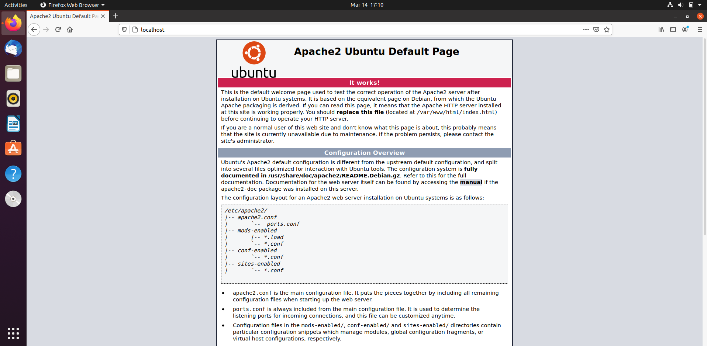
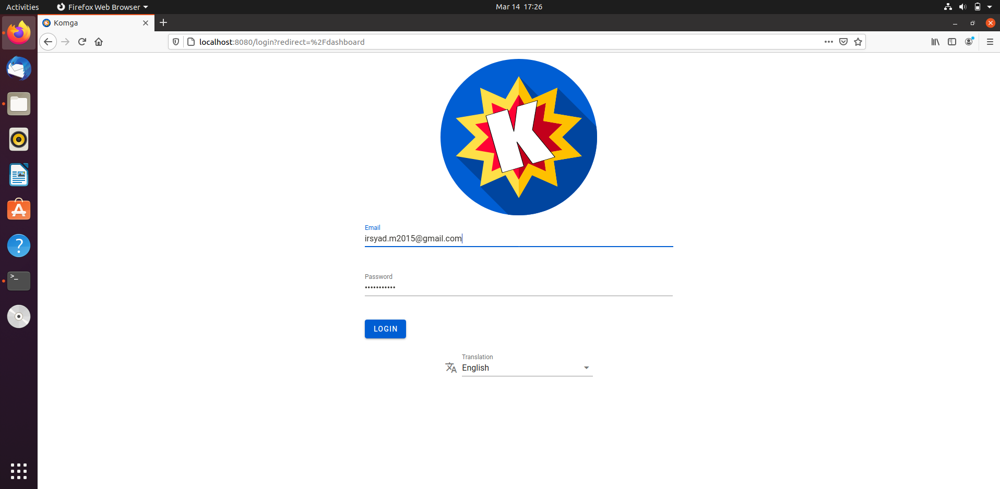
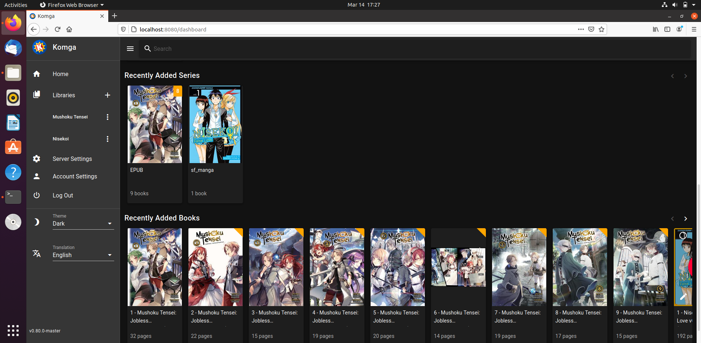

<p align="center">
  <!--<b>Some Links:</b><br>
  //<a href="#">Link 1</a> |
  //<a href="#">Link 2</a> |
  //<a href="#">Link 3</a>
  //<br><br> -->
  
</p>

<h3 align="center"> KOMGA </h3>


<h1 align="center">Laporan Proyek Akhir <br> Komunikasi Data dan Jaringan (KOM312) </h1>

Original repository : https://github.com/gotson/komga

Web official : https://komga.org/

# Anggota
<table>
    <thead>
        <tr>
            <th></th>
            <th>Nama</th>
            <th>Nim</th>
        </tr>
    </thead>
    <tbody>
        <tr>
            <td>1</td>
            <td>Irsyad Musyaffa</td>
            <td>G64180048</td>
        </tr>
        <tr>
            <td>2</td>
            <td>Rafi Solichin</td>
            <td>G64180068</td>
        </tr>
        <tr>
            <td>3</td>
            <td>M Ihsan Fadillah WP</td>
            <td>G64180071</td>
        </tr>
        <tr>
            <td>3</td>
            <td>M Fathan Fatazka</td>
            <td>G64180118</td>
        </tr>
</tbody>
</table>

---
[Deskripsi Aplikasi](#deskripsi-aplikasi) | [Proses Instalasi](#proses-instalasi) | [Referensi](#referensi) | [Port Forward](#port-forward-ke-windows)
:-:|:-:|:-:|:-:


# Deskripsi Aplikasi
[`^ Kembali Ke Atas ^`](#) 

Komga merupakan aplikasi server untuk komik dan manga, komga juga gratis dan open source.

Komga memiliki fitur antara lain :
- Browse libraries, series and books
- Search bar
- Download book files
- Manage multiple users, with per-library accesss control
- Webreader

Berikut adalah tipe file yang dapat dibaca oleh komga :
- Comic book archives: CBZ and CBR (except RAR5 and solid archives)
- Comic books in EPUB format
- PDF files

Komga juga dapat dijalankan pada semua sistem yang dapat menjalankan docker ataupun java :
- Windows
- macOS
- Linux
- Many popular NAS devices such as QNAP, Synology and more
---
Kami menginstall aplikasi pada VM lokal sistem operasi yang digunakan adalah Ubuntu 20.04.2.0 LTS

Ada dua metode untuk instalasi Komga :
- Menggunakan Docker
- Menggunakan java dengan jar file

Dalam hal ini kami menggunakan java

# Proses instalasi
[`^^ Kembali Ke Atas ^^`](#)

## 1. Java
Karena kami akan menggunakan java maka pastikan sudah memasang JRE/JDK pada mesin.
Pilihan termudah untuk menginstal Java adalah dengan menggunakan versi yang dikemas beserta Ubuntu. Secara asali, Ubuntu 20.04 meliputi Open JDK 11, yang merupakan varian sumber terbuka dari JRE dan JDK.

Untuk menginstal versi ini, perbarui indeks paket terlebih dahulu:
````
$ sudo apt update
````
Jalankan perintah berikut untuk menginstal Java Runtime Environment (JRE) asali yang akan menginstal JRE dari OpenJDK terbaru:
````
$ sudo apt install default-jre
````
atau bisa juga dengan perintah berikut:
````
$ sudo apt install default-jdk
````
## 2. Apache, MySQL, PHP(LAMP), dan Stack
Aplikasi akan dijalankan pada lokal dari mesin kita, untuk dapat menggunakan localhost maka diperlukan setup terhadap hal-hal tersebut.

Karena cukup detail maka silahkan kunjungi link berikut dan ikuti petunjuk yang ada pada artikel tersebut: https://www.digitalocean.com/community/tutorials/how-to-install-linux-apache-mysql-php-lamp-stack-ubuntu-18-04

Jika sudah selesai, coba masuk ke localhost melalui web browser. Maka tampilan nya akan seperti berikut:


## 3. Komga
Kita akan menjalankan komga menggunakan jar file, versi terbaru dari komga jar file dapat didownload melalui laman ini : https://github.com/gotson/komga/releases

pada laporan ini kami menggunakan komga v0.80.0, sebelum itu silahkan cek terlebih dahulu versi dari java yang ada pada mesin karena komga hanya dapat dijalankan pada
java version 8+ . Silahkan cek versi java dengan perintah ```` $ java --version ````

Lalu berikutnya jalankan perintah berikut untuk menjalankan Komga:
````
$ java -jar komga-0.80.0.jar
````
Setelah komga berhasil dijalankan, kita bisa mengakses web nya melalui : ```` http://<your-server>:<port>(/baseUrl) ````
karena pada laporan ini komga dijalakan pada lokal maka `` <your-server> `` adalah `` localhost `` dan default `` <port> `` adalah 8080.

Berikut adalah tampilan awal ketika mengakses localhost:8080  :

Silahkan melakukan pendaftaran akun dan login, Setelah itu akan diarahkan pada halaman home. 

halaman home tersebut telah kami isi dengan komik/manga dan EPUB yang sebelumnya telah disiapkan. Perlu perhatikan bahwa komga hanya dapat membaca tipe file tertentu, bisa di cek pada halaman awal laporan ini.

# Port Forward ke windows
Sekarang akan dilakukan port forward sehingga komga dapat dijalankan diluar VM, dalam hal ini yaitu dijalankan pada windows.

Sebelum itu pastikan telah menginstall open ssh pada windows dan VM, vm yang kami gunakan adalah ubuntu. Open ssh pada windows biasanya sudah otomatis terinstall, sedangkan pada vm ubuntu perlu instalasi terlebih dahulu. Lakukan command ini bertahap:
````
$ sudo apt-get install openssh-server
$ sudo systemctl enable ssh
$ sudo systemctl start ssh

````
Setelah selesai instalasi ssh pada vm dan juga menjalankannya. Selanjutnya silahkan pergi ke CMD windows dan login ke ssh
````
$ ssh user@server-name
````
User dapat di cek pada terminal vm dengan command `` hostname -I `` dan ``server-name`` default nya adalah ``localhost``

Setelah itu lakukan setting pada virtual box manajer, masuk ke 'Settings -> Network -> Advance -> Port Forwarding', berikut juga beberapa aturan yang kami tambahkan :

Aturan *port forwarding*
Name   | Protocol   | Host IP    | Host Port  | Guest IP   | Guest Port
----   | --------   | -------    | ---------  | --------   | ----------
http   | TCP        |127.0.0.1   | 8000       |10.0.2.15   | 80
ssh    | TCP        |127.0.0.1   | 2200       |10.0.2.15   | 22
App    | TCP        |127.0.0.1   | 8080       |10.0.2.15   | 8080

Sekarang Komga sudah siap dijalankan dengan aturan App dan berjalan pada port 8080 di host dan juga port 8080 di guest.

# Referensi
[`^^^ Kembali Ke Atas ^^^`](#)

1. [How to Install Linux, Apache, MySql, PHP (LAMP), and Stack](https://www.digitalocean.com/community/tutorials/how-to-install-linux-apache-mysql-php-lamp-stack-ubuntu-18-04) - Digtal Ocean
2. [Komga Source Code](https://github.com/gotson/komga) - Github
3. [Official Website](https://komga.org/) - Komga
4. [Install ssh on Ubuntu](https://www.cyberciti.biz/faq/ubuntu-linux-install-openssh-server/) 
